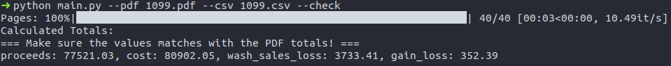

# Robinhood 1099 Parser

> This project converts Robinhood Securities 1099 tax document from PDF to CSV file. This tool will be helpful for those who need every transaction in a spreadsheet format for tax reporting purposes.


### Original Work

Copyright (c) 2021 Keun Park (kevin.park1217@gmail.com)

## 🚀 Running Locally

Make sure you have Python 3 on your computer. If not, download the latest version from [here](https://www.python.org/downloads/).

Environment Setup  
```bash
git clone https://github.com/kevinpark1217/Robinhood-1099-Parser.git
cd Robinhood-1099-Parser
python -m pip install -r requirements.txt
```

Start Parsing!
```bash
➜ python main.py 
usage: main.py [-h] --pdf FILE [--csv FILE] [--silent] [--check]
```

### Example and Checking

Enable `--check` flag to print out total values for some columns. Make sure these values match with the PDF!



## 🐞 Issues and Bugs
If you have any issues with the tool, please open a GitHub Issue with as much as detail as you can provide.